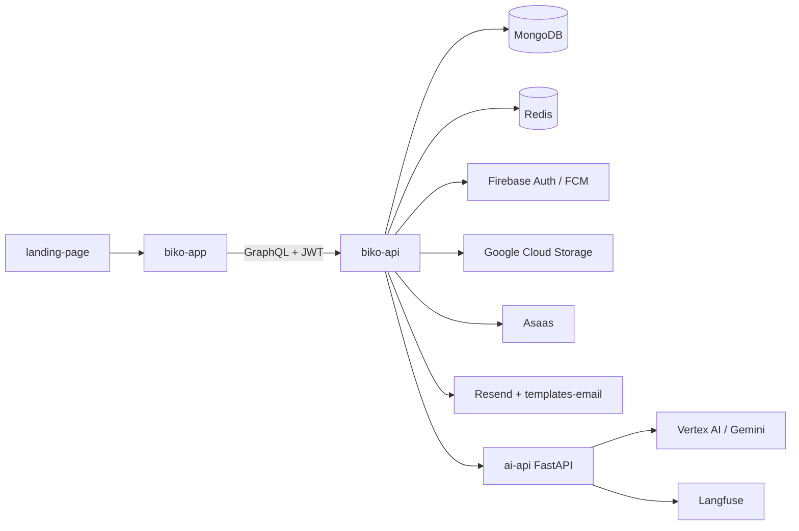

# Welcome to Byko

Welcome to the official repository of **Byko**! This is your starting point to explore and contribute.

## Our Stack

**App**:

**Backend**:

**Site institucional**:

## 💡 What is Byko?

Byko é uma plataforma que conecta, de forma simples e segura, quem precisa de um serviço a profissionais qualificados.

Cliente descreve o que precisa, um chat com IA ajuda a refinar o escopo do pedido, prestadores da categoria enviam propostas, e o cliente escolhe. Toda a negociação, o combinado e o pagamento (com repasse ao prestador) acontecem dentro da plataforma, substituindo o fluxo informal de indicação e contato direto por um processo digital, seguro e centralizado.

## 🧭 System design

- **biko-app** oferece as jornadas mobile de cliente e prestador.
- **biko-api** é o núcleo autoritativo: autenticação, domínio, persistência e integrações.
- **ai-api** refina solicitações de forma stateless; o histórico pertence à API.
- **landing-page** cuida da aquisição; **templates-email** compõe as comunicações transacionais.

A documentação detalhada, as fronteiras de cada serviço e o catálogo de recursos estão em [biko-co/documentation](https://github.com/biko-co/documentation).
